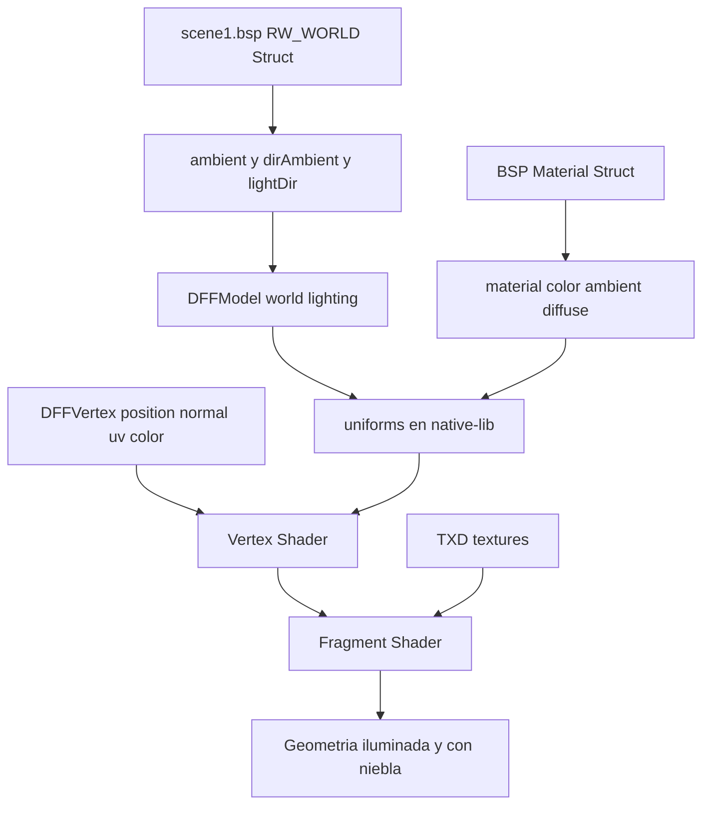

# Plan: Renderizado idéntico al Manhunt original (nivel Asylum)

Objetivo: que la geometría, iluminación, niebla, materiales y animación del port
reproduzcan el comportamiento **real** del motor de Manhunt 1, en lugar de usar
valores inventados (niebla negra 10-45, sin iluminación, etc.).

Todo se basa en los datos que ya están en los assets (`scene1.bsp`, `modelspc.dff`,
`entity.inst`, `allanims.ifp`) y en lo observado en los scripts de análisis
[`parse_bsp.py`](parse_bsp.py:37), [`parse_ifp.py`](parse_ifp.py:75),
[`parse_inst.py`](parse_inst.py:29), [`parse_hanim.py`](parse_hanim.py:20).

---

## Diagnóstico (qué se desvía del original)

1. **La iluminación del mundo se descarta.**
   El struct `RW_WORLD` (84 bytes) contiene, según [`parse_bsp.py`](parse_bsp.py:37):
   - `+16`: `ambientColor` (4 floats)
   - `+32`: `directionalAmbientColor` (4 floats)
   - `+48`: `lightDirection` (3 floats)
   Pero [`bsp_loader.cpp`](app/src/main/cpp/bsp_loader.cpp:61) hace `r.skip(36); format=read()` y **tira todo**. La iluminación de la escena debe salir de aquí, no de constantes.

2. **Los materiales del BSP se saltan.**
   [`bsp_loader.cpp`](app/src/main/cpp/bsp_loader.cpp:78) hace `r.skip(mat_struct.size)` y solo guarda el nombre de textura. El struct de material RW guarda color/ambient/diffuse que el motor usa.

3. **El shader ignora normales e iluminación.**
   [`native-lib.cpp`](app/src/main/cpp/native-lib.cpp:269) hace solo `texture * vertexColor` + niebla negra fija 10→45. El original usa ambient del mundo + luz direccional + niebla por distancia.

4. **Material sin textura = negro.**
   Si un grupo tiene `texture_id == 0`, se bindea textura 0 y `texture()*color` da negro. En el original los materiales sin textura usan su color propio.

5. **Timing de animación es una suposición.**
   [`ifp_loader.cpp`](app/src/main/cpp/ifp_loader.cpp:73) usa `/60.0f` marcado como "Guessing". [`parse_ifp.py`](parse_ifp.py:75) muestra que los frames tipo-1 son 11 bytes (2 tiempo + 1 pad + 8 quat) y los tipo-3 más largos (incluyen traslación).

6. **Campos extra por instancia descartados.**
   [`parse_inst.py`](parse_inst.py:36) muestra datos tras `Pos(3)+Rot(4)` que [`inst_loader.cpp`](app/src/main/cpp/inst_loader.cpp:40) no lee.

---

## Plan de trabajo

### Fase 1 — Iluminación del mundo (mayor impacto visual)

1. **Extender `DFFModel`** (en [`dff_loader.h`](app/src/main/cpp/dff_loader.h:30)) con:
   - `float world_ambient[4]`
   - `float world_dir_ambient[4]`
   - `float world_light_dir[3]`
2. **`bsp_loader.cpp`**: al leer `RW_STRUCT` del `RW_WORLD`, leer correctamente por offset
   (rootIsWorldSector → invWorldOrigin → ambient → dirAmbient → lightDir → counts → format),
   en lugar de `skip(36)`. Guardar los 3 vectores en el `DFFModel`.
3. Guardar estos valores globalmente en [`native-lib.cpp`](app/src/main/cpp/native-lib.cpp:426) (`setup_model`).

### Fase 2 — Materiales del BSP

4. **Parsear el struct de material RW** en [`bsp_loader.cpp`](app/src/main/cpp/bsp_loader.cpp:78):
   color (RGBA), ambient, diffuse, specular. Guardarlos por material junto al nombre de textura.
5. Extender `DFFModel` con `std::vector<MaterialData> materials` (color, ambient, diffuse, texture).
6. Pasar el color/ambient del material al shader por grupo de dibujo.

### Fase 3 — Shaders fieles al original

7. **Vertex shader**: calcular normal de mundo (`mat3(u_model) * a_normal`) y pasarla al fragment; con skinning, transformar la normal con la matriz de hueso.
8. **Fragment shader**:
   - `base = (hasTex ? texture(...) : 1.0) * vertexColor * materialColor`
   - `lit = base * (worldAmbient + max(dot(N, L), 0) * dirAmbient)` usando la luz del mundo.
   - Niebla por distancia con color de niebla del nivel (o valor original), no negro 10-45 fijo.
9. Añadir uniforms: `u_world_ambient`, `u_dir_ambient`, `u_light_dir`, `u_material_color`, `u_has_tex`.
10. **Fallback sin textura**: `u_has_tex=0` → usar color de material/vértice (elimina el negro).

### Fase 4 — Transparencia / alpha

11. Revisar el umbral de `discard` y el orden de dibujo de materiales con alpha (cristales, vallas, etc.) para que coincida con el original. Considerar `glEnable(GL_BLEND)` para materiales alpha.

### Fase 5 — Animación (IFP)

12. Corregir tamaño/tiempo de frame según [`parse_ifp.py`](parse_ifp.py:75):
    - tipo 1: 11 bytes/frame (2 tiempo + 1 pad + 8 quat)
    - tipo 3: incluir traslación (2+1+8+6, más campos extra observados)
13. Confirmar mapeo `bone_id` (IFP) → frame (DFF) para que la animación correcta se aplique a cada hueso.

### Fase 6 — Instancias

14. Extender [`inst_loader.cpp`](app/src/main/cpp/inst_loader.cpp:40) para leer los campos posteriores a `Pos`/`Rot` (color/lighting por objeto si aplican).

### Fase 7 — Verificación

15. Build (`gradlew :app:assembleDebug`) y ejecutar en el nivel Asylum.
16. Comparar lado a lado contra capturas del Manhunt original: iluminación, tono de niebla, colores de paredes/piso, animación de Cash.

---

## Diagrama de flujo de datos de iluminación

