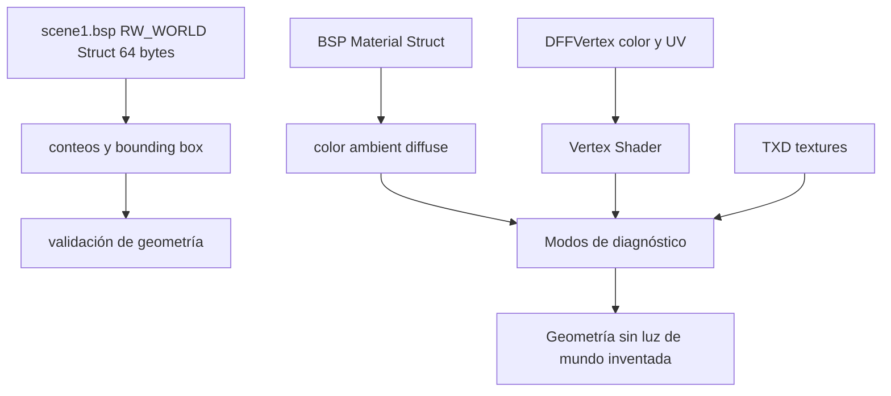

# Plan: Renderizado idéntico al Manhunt original (nivel Asylum)

Objetivo: que la geometría, iluminación, niebla, materiales y animación del port
reproduzcan el comportamiento **real** del motor de Manhunt 1, en lugar de usar
valores inventados (niebla negra 10-45, sin iluminación, etc.).

Todo se basa en los datos que ya están en los assets (`scene1.bsp`, `modelspc.dff`,
`entity.inst`, `allanims.ifp`) y en lo observado en los scripts de análisis
[`parse_bsp.py`](parse_bsp.py:37), [`parse_ifp.py`](parse_ifp.py:75),
[`parse_inst.py`](parse_inst.py:29), [`parse_hanim.py`](parse_hanim.py:20).

---

## Diagnóstico (qué se desvía del original)

1. **El layout del mundo estaba mal interpretado.**
   El `RW_WORLD` de `scene1.bsp` mide 64 bytes. En `+16` empiezan los conteos de geometría, no colores de luz: `numTriangles`, `numVertices`, `numPlaneSectors`, `numAtomicSectors`, `colSectorSize`, `format`; desde `+40` está la caja envolvente. Por tanto, este struct no aporta `ambientColor`, `directionalAmbientColor` ni `lightDirection`. El loader ahora deja la iluminación del mundo como no disponible y compara los conteos declarados con los sectores y la geometría extraída.

2. **Los materiales del BSP se saltan.**
   [`bsp_loader.cpp`](app/src/main/cpp/bsp_loader.cpp:78) hace `r.skip(mat_struct.size)` y solo guarda el nombre de textura. El struct de material RW guarda color/ambient/diffuse que el motor usa.

3. **No hay todavía una fuente de luz del mundo verificada.**
   Los antiguos modos de debug que multiplicaban por `world.ambient`, `dir_ambient` o `light_dir` usaban bytes de conteos/caja y podían teñir la escena. Se quitaron. Los modos de diagnóstico actuales son: prelit (color de vértice), prelit × color de material y textura sola. Esto es diagnóstico, no una afirmación de que reproduzca toda la iluminación original.

4. **Material sin textura = negro.**
   Si un grupo tiene `texture_id == 0`, se bindea textura 0 y `texture()*color` da negro. En el original los materiales sin textura usan su color propio.

5. **Timing de animación es una suposición.**
   [`ifp_loader.cpp`](app/src/main/cpp/ifp_loader.cpp:73) usa `/60.0f` marcado como "Guessing". [`parse_ifp.py`](parse_ifp.py:75) muestra que los frames tipo-1 son 11 bytes (2 tiempo + 1 pad + 8 quat) y los tipo-3 más largos (incluyen traslación).

6. **Campos extra por instancia descartados.**
   [`parse_inst.py`](parse_inst.py:36) muestra datos tras `Pos(3)+Rot(4)` que [`inst_loader.cpp`](app/src/main/cpp/inst_loader.cpp:40) no lee.

---

## Plan de trabajo

### Fase 1 — Layout real de RW_WORLD (corregido)

1. Leer exactamente 64 bytes: `rootIsWorldSector` (+0), `invWorldOrigin[3]` (+4), seis enteros de conteo/formato (+16..+36) y caja envolvente (+40..+60).
2. Mantener la iluminación del mundo como no disponible (`valid=false`); no derivar luces de estos campos.
3. Comparar `numTriangles` y `numVertices` del header con la suma declarada de sectores y con la geometría realmente extraída. El loader rechaza el BSP si hay discrepancia.

### Fase 2 — Materiales del BSP

4. **Parsear el struct de material RW** en [`bsp_loader.cpp`](app/src/main/cpp/bsp_loader.cpp:78):
   color (RGBA), ambient, diffuse, specular. Guardarlos por material junto al nombre de textura.
5. Extender `DFFModel` con `std::vector<MaterialData> materials` (color, ambient, diffuse, texture).
6. Pasar el color/ambient del material al shader por grupo de dibujo.

### Fase 3 — Shaders fieles al original

7. **Vertex shader**: calcular normal de mundo (`mat3(u_model) * a_normal`) y pasarla al fragment; con skinning, transformar la normal con la matriz de hueso.
8. **Modos de diagnóstico disponibles**: prelit (color de vértice), prelit × color del material y textura sola. No activar iluminación por normales hasta localizar una fuente de luz válida en los assets o en el comportamiento del motor.
9. No usar `RW_WORLD` como fuente de iluminación. Material ambient/diffuse son coeficientes del material; por sí solos no prueban que el juego aplique iluminación dinámica.
10. **Fallback sin textura**: `u_has_tex=0` → usar color de material/vértice (elimina el negro).

### Fase 4 — Transparencia / alpha

11. Revisar el umbral de `discard` y el orden de dibujo de materiales con alpha (cristales, vallas, etc.) para que coincida con el original. Considerar `glEnable(GL_BLEND)` para materiales alpha.

### Fase 5 — Animación (IFP)

12. Corregir tamaño/tiempo de frame según [`parse_ifp.py`](parse_ifp.py:75):
    - tipo 1: 11 bytes/frame (2 tiempo + 1 pad + 8 quat)
    - tipo 3: incluir traslación (2+1+8+6, más campos extra observados)
13. Confirmar mapeo `bone_id` (IFP) → frame (DFF) para que la animación correcta se aplique a cada hueso.

### Fase 6 — Instancias

14. Extender [`inst_loader.cpp`](app/src/main/cpp/inst_loader.cpp:40) para leer los campos posteriores a `Pos`/`Rot` (color/lighting por objeto si aplican).

### Fase 7 — Verificación

15. Build (`gradlew :app:assembleDebug`) y ejecutar en el nivel Asylum.
16. Comparar lado a lado contra capturas del Manhunt original: iluminación, tono de niebla, colores de paredes/piso, animación de Cash.

---

## Diagrama de flujo de datos de iluminación

## Verificación de materiales y luces: estado actual

- **Verificado en el código:** el parser de materiales BSP y DFF lee RGBA, `ambient`, `specular` y `diffuse` desde el struct RenderWare de material. El renderizador envía color, ambient y diffuse como uniforms, pero los coeficientes ambient/diffuse no estaban aplicándose en la ecuación del fragment shader; el shader anterior multiplicaba colores y, en los modos 1–3, utilizaba el supuesto `RW_WORLD` como luz.
- **No verificado con valores de assets:** no se inspeccionó aquí la tabla completa de materiales de `scene1.bsp` ni de `cash_pc.dff`; por lo tanto, no afirmo qué valores ambient/diffuse tienen sus materiales.
- **Luces dinámicas sobre Cash:** el código de port visible no contiene una fuente de luz de mundo válida derivada de `RW_WORLD`, ni una implementación confirmada de luces dinámicas por personaje. Eso no demuestra que el juego original no las use. Para confirmarlo hacen falta datos del DFF/otros chunks de luz o una inspección del ejecutable/comportamiento original.
- **Pendiente:** extraer y registrar los materiales reales de `cash_pc.dff` y `scene1.bsp`, localizar chunks/entidades de luces y comparar capturas del juego original con las tres vistas de diagnóstico.
